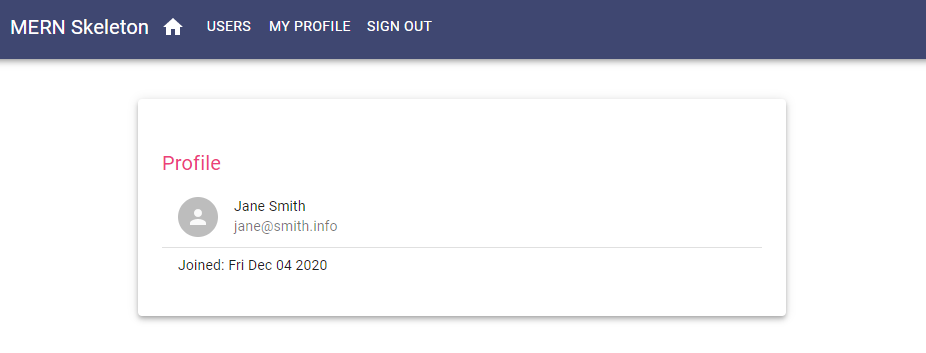

# Baisc MERN Skeleton

## Project Description

This project was built using the guide provided by Shama Hoque in 'Full-Stack React Projects - 2nd Edition' published by Packt. It provides a basic method for authenticating a user with JSON Web Tokens. Users can be created, user profiles can be edited and deleted provided the user is authenticated and authorized to edit/delete the profile.

The project is intended to be used a starting point for custom web applications that require basic user authenticaiton and authorization. It can be extended for various types of projects. 

Mostly this repo served as my own project for learning how to build a simple MERN web application framework for user authentication and authorization. If you're learning I strongly recommend going through the projects in the book yourself. Here's the [link](https://www.packtpub.com/product/full-stack-react-projects-second-edition/9781839215414).

## Stack

- Core Dependencies
  - Node
  - Express
  - Express-JWT
  - MongoDB
  - Mongoose
  - React
  - React Router
  - CORS
  - Cookie Parser
  - Lodash
  - Helmet
  - JSONWebToken
  - Compression
  - @hot-loader/react-dom
- Development Dependencies
  - Babel
  - Babel-Loader
  - File-Loader
  - Nodemon
  - Prettier
  - Webpack

## Screenshots

Here is the unauthenticated Home Page

This is the Users page which shows a list of all users in the database with a link to their profile page.

This is the unauthenticated Profile Page. This component will not all an unauthorized user to edit or delete the user profile.

This is the Signup page. This navigation link will display if the user is not currently authenticated.

This is the Signin page.

This is the authenticated Home Page

This is the authenticated & authorized view of the Profile Page. A user has the option to Edit or Delete their profile.

This is the Edit Profile Page.

